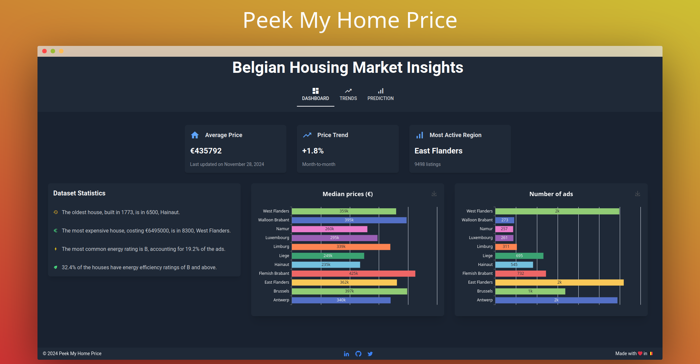
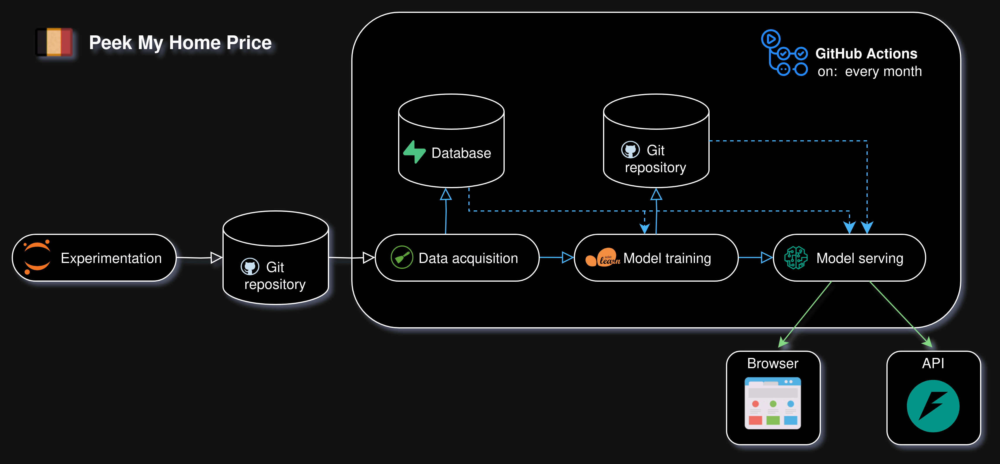

# Peek My Home Price: Predicting Belgian Real Estate Prices

    

**Peek My Home Price** is a web application that predicts house prices in Belgium using machine learning.  Leveraging a CatBoost model and MAPIE (Model Agnostic Prediction Intervals Estimator), it provides accurate price estimates and quantifies uncertainty with confidence intervals. Explore market trends, analyze key factors, and get informed estimates.

**Try it out:** [https://peek-my-home-price.fly.dev/](https://peek-my-home-price.fly.dev/)

## Key Features

* **Real-time Price Predictions:**  Enter property details to receive instant price estimates.
* **Confidence Intervals:**  Understand the range within which the actual price is likely to fall.
* **Interactive Dashboard:**  Visualize market trends, average prices, and other key statistics.
* **Historical Trend Analysis:**  Explore median price changes over time for each Belgian province.
* **Robust and Scalable:**  Built with a modern tech stack (Python, CatBoost, Scrapy, NiceGUI, Fly.io) for reliability and scalability.

## How it Works

This project combines web scraping, data analysis, machine learning, and a user-friendly interface:

1. **Data Collection:**  Property data is scraped from leading Belgian real estate platforms using Scrapy and Playwright, ensuring up-to-date information.
2. **Data Preprocessing:**  The scraped data is cleaned, transformed, and prepared for model training. 
3. **Model Training:** A CatBoost regressor model is trained on historical data to predict property prices. Hyperparameter tuning is performed using RandomizedSearchCV to optimize model accuracy.
4. **Uncertainty Estimation:** MAPIE is used to calculate prediction intervals, providing a measure of uncertainty around each price estimate.
5. **Web Application:**  The user interface, built with NiceGUI and FastAPI, allows users to input property details and receive predictions with confidence intervals.  Interactive dashboards visualize market trends and key statistics.

## Technical Details

    

* **Model:** CatBoost Regressor with MAPIE for prediction intervals.
* **Data Sources:**  leading Belgian real estate platforms
* **Data Storage:** Supabase (PostgreSQL)
* **Web Framework:** NiceGUI, FastAPI
* **Web Scraping:** Scrapy, Playwright, scrapy-user-agents
* **Deployment:** Docker, Fly.io

## Project Structure

* **`src/scraper`:** Contains the web scraping logic using Scrapy.
* **`src/database`:** Handles database connection and data retrieval using Supabase.
* **`src/model_training`:**  Implements the data preprocessing, model training, and evaluation pipeline.
* **`src/ui`:** Contains the NiceGUI and FastAPI code for the user interface and API.
* **`notebooks`:** Jupyter notebooks detailing the data analysis and model development process.
* **`models`:** Stores the trained machine learning model.

## Installation and Deployment (for Developers)

1. **Clone the repository:** `git clone https://github.com/adamcseresznye/peek_my_home_price`
2. **Install dependencies:** `pip install -r requirements.txt`
3. **Set up Supabase:** Create a Supabase project and configure the connection details in environment variables (`SUPABASE_URL`, `SUPABASE_KEY`).
4. **Run the application locally:** `uvicorn src.ui.main:api --reload`

## Disclaimer

This project is intended for educational and informational purposes. The price predictions are estimates and should not be considered financial advice.  Always consult with a qualified real estate professional for accurate property valuations.  The developer is not responsible for any decisions made based on the information provided by this application.

## License

GPL-3.0 license